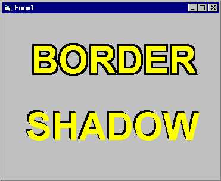



## A Couple of Label Effects

### Description

Makes Boring Labels look a little bit more interesting
 
### More Info
 
Label to apply effects to, EffectSize, Effect Color, Text Color, Border or Shadow

Requires an array of labels, one with index=0

Let me know if you find any.

             |
---                |---
**Submitted On**   |2001-09-17 08:38:52
**By**             |[Paul Crowdy](https://github.com/Planet-Source-Code/PSCIndex/blob/master/ByAuthor/paul-crowdy.md)
**Level**          |Beginner
**User Rating**    |4.8 (29 globes from 6 users)
**Compatibility**  |VB 5\.0, VB 6\.0
**Category**       |[Graphics](https://github.com/Planet-Source-Code/PSCIndex/blob/master/ByCategory/graphics__1-46.md)
**World**          |[Visual Basic](https://github.com/Planet-Source-Code/PSCIndex/blob/master/ByWorld/visual-basic.md)
**Archive File**   |[A Couple o265639172001\.zip](https://github.com/Planet-Source-Code/paul-crowdy-a-couple-of-label-effects__1-27229/archive/master.zip)

